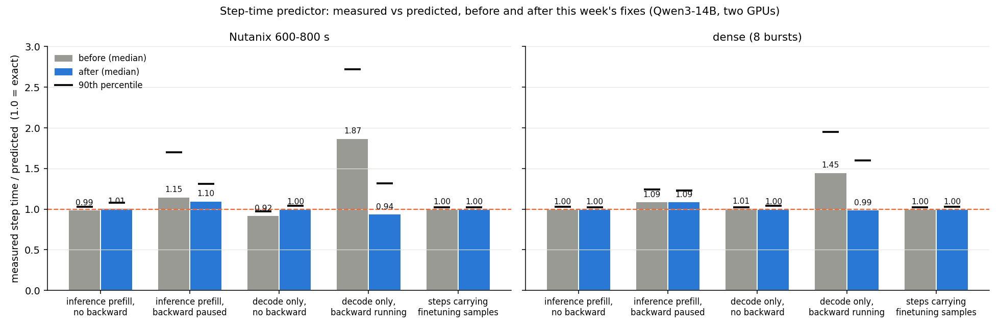
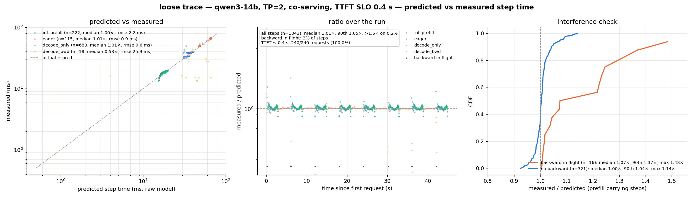
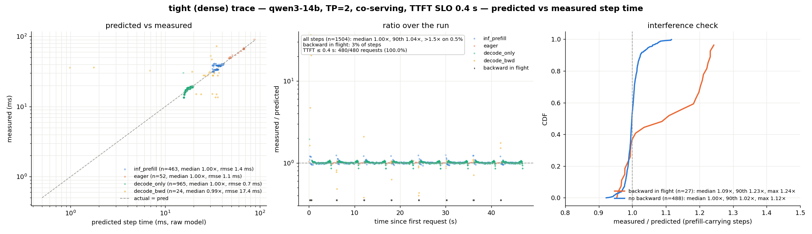
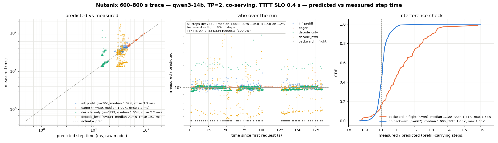
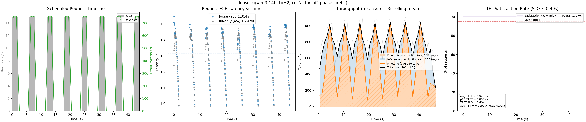
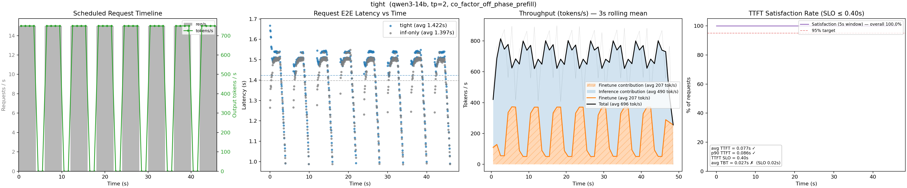
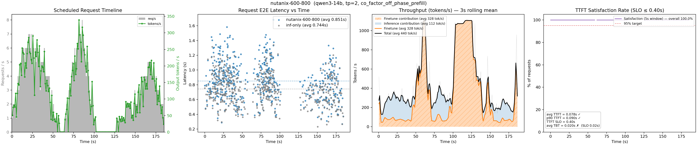

# Weekly report — week of September 1

DeltaServe on vLLM: co-serving LoRA finetuning next to inference on two RTX 5090s
(tensor parallelism across the two GPUs). This report covers closing the remaining gaps in
the backward pass under tensor parallelism, cutting the backward's own cost by about a
third, making inference pre-emption of finetuning work with two GPUs, and validating the
whole stack on both model families (Llama-3-8B and Qwen3-14B) against recorded request traces.

## 1. CUDA graphs for the backward pass, now with tensor parallelism

**Background.** The finetuning backward pass runs in a separate process on each GPU. It
rematerializes each transformer layer's forward from saved activations, then computes the
LoRA gradients by hand. Previously the backward could run as a set of CUDA graphs on
a single GPU (a graph replays a pre-recorded sequence of kernels with one launch, removing
per-kernel dispatch cost), but with two GPUs it was forced back to eager execution.

**Why two GPUs were harder.** Under tensor parallelism each GPU holds half of every
attention head and half of the feed-forward block, and the two halves have to be added
together at several points in every layer with an all-reduce over NCCL. A collective inside
a captured graph is possible but dangerous here: the backward must yield the GPU to
inference at every layer boundary (a host-side wait that cannot be captured), and a
one-sided abort with a collective in flight would deadlock both GPUs. So the rule became
**no collective is ever inside a graph**.

**What we did.** Six of the seven all-reduces per layer already sat in eager code between
the captured regions. The seventh, the output-projection sum of the forward
rematerialization, sat inside the forward graph. We split that graph at the output
projection: the captured part ends at the partial sum, the all-reduce runs eagerly, and a
short eager tail finishes the layer. On a single GPU the tail is captured together with the
core, so single-GPU behaviour is bit-identical to before. The graphed backward also had
to be taught the six backward-side reductions; they were missing, so enabling graphs under
TP without that would have trained on un-reduced gradients.

**Structure.** Three captured regions per layer: the forward rematerialization, the
feed-forward backward, and one shared padded-attention backward used by every layer.
Llama-3-8B: 65 graphs, captured once at startup in about 0.3 s. The GPU-yield point stays
between the two backward replays of each layer, once per layer, unchanged from the eager
path.

**Verification.** Two new tests run on both GPUs with real NCCL: a layer-level parity test
(graph equals eager on each GPU to 1e-5, equals the single-GPU reference, identical across
GPUs, including the fallback path when a batch overflows the padded attention budget;
4020 checks) and a trainer-level test that runs the real training loop for several steps
and compares losses and adapter weights across graph, eager, and single-GPU (220 checks).

## 2. Where the backward's time goes, and what we removed

### 2.1 Recompute, activation saving, and the LM head

**The pipeline and where the GPUs must talk.** Each backward cycle walks the layers from
the top down. Under tensor parallelism every layer needs a few all-reduces because each
GPU holds only half of the attention heads and half of the feed-forward block. The two
diagrams below show the same cycle before and after the optimizations; the right-hand
diagram is also the reference for the transfer changes in 2.2.

**All-reduce inventory per layer** (sizes for Qwen3-14B at 256 tokens; measured cost on
this box, whose GPUs have no peer-to-peer link so every collective crosses PCIe through
host memory):

| all-reduce | tensor | size | cost | before | after |
|---|---|---|---|---|---|
| output-projection partial sum | forward rematerialization | 2.5 MB | 0.36 ms | every layer | gone: the post-attention residual is saved in the forward |
| feed-forward gradient partial | backward | 2.5 MB | 0.36 ms | every layer, inline | every layer, inline |
| attention-path gradient partial | backward | 2.5 MB | 0.36 ms | every layer, inline | every layer, inline |
| replicated LoRA-factor gradients (q/k/v A, o B) | backward | 4 × 160 KB | 4 × 0.045 ms | every layer, inline | into a flat buffer, one reduce per 8 layers on a second stream |
| clip norms | after the loop | 40 floats | negligible | — | one reduce per cycle |
| **per cycle (40 layers)** | | | | **280 collectives** | **86 collectives** |

**Activation saving instead of recompute.** The backward used to rebuild most of each
layer's forward from the saved layer input. Three more per-layer tensors are now saved
during the inference forward, each behind a config flag:

| saved tensor | captured where | what the backward no longer recomputes | memory (Qwen3-14B, 256 tokens, per GPU) |
|---|---|---|---|
| q/k/v | post-RoPE for Llama-3; pre-norm q/k plus v for Qwen3 | the Q/K/V projection GEMM and RoPE (Qwen3: only its per-head norm and RoPE remain, both elementwise) | ~48 MB |
| attention context | output of the attention kernel | the attention forward: scores, softmax, AV | ~16 MB |
| post-attention residual | input of the post-attention norm | the output-projection GEMM, the residual add, and the forward's only all-reduce | ~100 MB (full width) |

Qwen3 needed its own variant for q/k: its per-head normalisation sits between the
projection and RoPE, so the values seen after attention are not what the norm's backward
needs. Capturing q and k at the input of the norm modules makes the shortcut exact.

**What is still recomputed per layer, with everything on:**

| item | recomputed? | why |
|---|---|---|
| input RMSNorm | yes | the Q/K/V LoRA-A gradients need the normalised input; it is one elementwise pass, cheaper to redo than to store |
| Q/K/V projection, attention forward, output projection | no | saved above |
| feed-forward gate/up pre-activations | no | saved since an earlier phase |
| softmax inside the attention backward | yes | rebuilt from q/k, standard practice (storing it would cost a per-layer [samples, heads, L, L] tensor) |
| LM head logits | yes, once per cycle | the inference forward only materialises last-token logits; the full fp32 logits GEMM is unavoidable |

**Where a cycle's time goes.** One real backward cycle on a Qwen3-14B-shaped model, two
GPUs, no inference running, graphs and all activation saves on, bucketing on. Each phase
of the right-hand diagram above was timed with CUDA events on the compute stream, so the
numbers are the time the stream spends in that phase, including any waiting; the bucket
reduces run on the communication stream and are listed separately. Eager phases include
the moments the GPU idles while the CPU launches their kernels.

| phase (as in the diagram) | ms per cycle | share | note |
|---|---|---|---|
| Loss + LM-head backward | 22.0 | 18 % | fp32 logits and logit-gradient GEMMs; was 63 ms before the restructure |
| Forward rematerialization | 10.6 | 9 % | the input RMSNorm plus staging the saved activations into the graphs' static buffers |
| FFN backward | 19.9 | 16 % | graph replay; the largest GEMMs of the layer |
| all-reduce: FFN partial | 15.6 | 13 % | 40 × 2.5 MB over PCIe |
| O-proj backward | 0.1 | | eager |
| Attention backward | 7.9 | 6 % | graph replay |
| RoPE + q/k-norm backward | 2.7 | 2 % | eager, elementwise |
| Q/K/V backward | 11.8 | 10 % | eager; mostly launch gaps, the arithmetic is small |
| Input-norm backward | 7.0 | 6 % | eager, fp32 |
| all-reduce: attention partial | 15.5 | 13 % | 40 × 2.5 MB over PCIe |
| wait for buckets + gradient clipping | 5.1 | 4 % | includes the one [L]-vector reduce |
| Optimizer step (fused AdamW) | 0.4 | | |
| pause boundaries | 0.2 | | host-side waits only |
| **compute stream total** | **119** | | cycle wall 122 ms |
| bucket reduces (communication stream) | 3.6 | overlapped | off the critical path |

Two things stand out. The two residual all-reduces are 31 ms, a quarter of the cycle, and
are the floor for tensor parallelism on hardware without a peer-to-peer link. The eager
phases between those two reduces (O-proj, Q/K/V, RoPE, norm backwards) add up to about
22 ms of stream time for a few milliseconds of arithmetic; now that no collective sits
among them, they are the natural next candidate for graph capture.

**What changed to get here:**

| component | before | after |
|---|---|---|
| LM head | 63 ms | 22 ms: all rows batched into one GEMM per vocabulary chunk, each bf16 chunk converted to fp32 once per pass (was per sample); same fp32 math, verified to 1e-7 |
| collectives | 37 ms, 240 on the compute stream | 31 ms on the compute stream (80 residual reduces) + 3.6 ms overlapped on the communication stream (5 buckets) + 1 reduce inside clipping |
| forward rematerialization | Q/K/V GEMM, attention, O-proj GEMM and an all-reduce per layer | one RMSNorm per layer plus staging copies |
| **cycle** | **~165 ms** | **~122 ms** |

In total the uncontended Qwen3-14B cycle went from ~194 ms (eager, no saves) to
~122 ms: roughly 5 ms from graphs, 15 ms from the activation saves, 41 ms from the head,
and a few ms from the transfer changes in 2.2.

### 2.2 GPU-to-GPU transfer: bucketing and a communication stream

**Before** (left-hand side of the diagram above). All 240 reductions per cycle were
issued inline, on the same CUDA stream as the compute, at the point in the layer where
each gradient was produced: the two residual-stream partials that the next operation needs
immediately, and the four replicated LoRA-factor gradients that nobody reads until the
optimizer step at the end of the cycle. Each reduce is a rendezvous between the two GPUs,
so the compute stream stalled 7 times per layer, and the backward process was started
with the CUDA setting that pins every stream onto a single hardware queue (inherited from
the original DeltaServe), so no overlap between communication and compute was possible
even in principle.

There was also a correctness problem hiding in the same place: gradient clipping ran
per layer on each GPU over the tensors that GPU held, replicated factors in full but only
its own half of the sharded ones. The two GPUs derived slightly different clip scales and
applied them to gradients that are supposed to be identical, so their replicated adapter
weights drifted apart whenever a layer's gradient norm exceeded the clip threshold.

**After** (right-hand side). The two residual-stream reduces stay where they are, since
the next operation depends on them. The four factor gradients are instead copied into one
persistent flat buffer as they are produced and reduced once per group of eight layers on
a dedicated communication stream, overlapping the next group's compute; 240 collectives
become 86 (80 residual reduces, 5 buckets, 1 for clipping). Clipping moves after the
bucketed reduce and uses a norm that sums the sharded halves across GPUs in one tiny
collective, so both GPUs scale identically. The single-queue setting is gone.

**Ordering correctness** lives in one helper: every submit waits for the producing
compute, every consumer waits for the completion event, only persistent buffers are
submitted. It is tested by running the same training with a synchronous mode (wait after
every reduce) and a delay-injection mode (the communication stream spins before each
collective, so any missing wait reads stale data every time) and requiring bit-identical
results, plus a CPU test where the clip fires and the two-GPU run must match the
single-GPU run. The measured time saving is small, about 2 ms per cycle, because the 80
residual reduces stay on the critical path; that is the floor for tensor parallelism on
this hardware. The real gain is the correctness fix.

## 3. Inference pre-empting finetuning-only steps

<table>
<tr>
<td width="58%" valign="top">

<b>What it is.</b> When no inference request is waiting, the scheduler builds steps made only of finetuning samples. An inference request that arrives during such a step would otherwise wait for it to finish. Pre-emption lets the request cut in at three points: a short wait on the input queue before an FT-only step is scheduled, a rollback if a request landed between scheduling and dispatch, and an abort in the middle of the forward. The mid-forward abort is an event that the engine's input thread sets on arrival and that the per-layer activation hooks check; the hook raises, the runner returns an empty result, and the scheduler restores its bookkeeping so the samples are retried later.

<b>Single GPU.</b> Everything runs in one process, so a shared in-memory event is enough.

<b>Two GPUs: the challenges.</b> The GPU workers are separate processes from the engine, so the event never reached them; the feature was silently inert. Worse, even with a signal, each GPU checking it independently would be wrong: an FT-only forward runs a collective every layer, so if one GPU leaves at layer k while the other continues, the other blocks forever in the next collective. The abort has to be a joint decision. Further, the "aborted" marker on the result was a dynamic attribute that did not survive the worker-to-engine hop, and the engine's async pipeline calls a second sampling entry point that also had to know about the abort.

<b>What we built.</b> The engine publishes an arrival counter in POSIX shared memory, created before the workers are spawned. Each worker compares the counter against its value at forward start, once at entry and once per layer boundary, and MAX-all-reduces its local bit over the TP group's CPU (gloo) group before acting, so both GPUs always take the same decision at the same layer; one small CPU collective per layer, no GPU sync. The first live run exposed a mistake: the hooks are armed for every batch that carries finetuning samples, including mixed batches with inference tokens, and those were being aborted too, taking their inference requests' step with them. The decision is now active only for FT-only forwards. Two secondary findings were also fixed: the CPU launches layers far ahead of the GPU, so a hook-time abort only saved the un-launched tail (the poller now bounds the launch-ahead to two layers), and, most importantly, most burst-start requests were slow for a different reason entirely.

<b>The pause finding.</b> On the dense trace, the first request of each burst usually arrived while the backward was running, not during an FT-only forward. Its prefill took 80 to 200 ms instead of 40 ms because the "yield the GPU to prefill" grant was re-set right after the prefill was enqueued, not when it finished, so the backward resumed immediately and the two processes time-sliced against each other on the GPU. The runner now records a CUDA event behind the prefill and resumes the backward only when that event has completed.

</td>
<td width="42%" valign="top">

</td>
</tr>
</table>

**Result on the dense trace (Qwen3-14B, 8 bursts of 60 requests):**

| run | TTFT satisfaction | p99 | max | first request of each burst (ms) | FT tok/s |
|---|---|---|---|---|---|
| inference only | 100 % | 86 ms | 113 ms | 40 41 40 39 38 40 38 41 | — |
| co-serving, before | 99.2 % | 377 ms | 577 ms | 92 52 144 53 44 40 458 58 | 277 |
| co-serving, after | 100 % | 91 ms | 150 ms | 55 60 67 61 61 60 59 64 | 262 |

## 4. Validation

Both families now co-serve the loose, dense, and Nutanix traces with the full stack
(inference-only satisfaction is 100 % on every trace):

| | TTFT satisfaction (loose / dense / Nutanix) | FT tok/s |
|---|---|---|
| Qwen3-14B TP=2 | 98.3 / 100 / 99.4 % (1 Sept: 95.0 / — / 98.1) | 642 / 262 / 392 (was 467 / — / 239) |
| Llama-3-8B TP=2 | 99.2 / 96.9 / 98.5 % (SLO 0.25 s) | 1088 / 641 / 814 |

Also verified: the Llama-3 RoPE base-frequency fix from last week (the backward's
rematerialization now matches the served model to bf16 noise and the loss no longer
stalls), and the Qwen3-0.6B single-GPU path, which needed a fix for models whose LM head
is tied to the embedding.

## 5. Verifying the step-time predictor on two GPUs, and what it exposed

<b>Why this matters.</b> The scheduler only admits finetuning samples into an inference step when a step-time predictor says the step will still meet its latency targets: time-to-first-token for waiting requests and time-between-tokens for running ones. The predictor is a small linear model of the step's composition (prefill tokens, finetuning tokens, decode requests, cached context), seeded by a profiling pass at launch and refit online. On two GPUs its accuracy had never been checked, and we suspected it was off even on one.

<b>How we checked it.</b> The server can now record a trace with one row per step: the composition that actually ran, what the admission decision assumed it would be, the predicted time, the GPU time measured with CUDA events, the CPU time spent dispatching, and whether the backward process had work in flight or was paused. It costs a few microseconds per step on the scheduler thread and writes from a helper thread, so it does not perturb what it measures (the previous validation mode switched asynchronous scheduling off, i.e. it measured a different system). An analysis tool joins the trace with the per-request results and the backward log, scores the predictor per step type, splits the misses by suspected cause, and lists every SLO violation with the steps that ran while the request waited.

<b>What we found.</b> On the dense and Nutanix traces the predictor is accurate for every step the admission decision actually reasons on: within 1 to 2 ms, median measured/predicted 1.00. Every systematic miss had one cause: the backward process sharing the GPU. Without MPS the driver time-slices the two processes, so
(1) decode-only steps, which by design never pause the backward, ran 1.5 to 1.9× their prediction at the median and up to 9× (a 16 ms step taking 195 ms);
(2) prefill steps, which do pause the backward, were still 10 to 15 % slow at the median and up to 2.3× right after a backward started; and
(3) these contended samples leaked into the online refit and distorted it, so even clean decode steps were over-predicted by 8 %.
Two suspects were cleared: the admission decision's guess of the step composition was right 95 % of the time and conservative otherwise, and the CPU was never the bottleneck. The damage showed up in time-between-tokens, not in time-to-first-token, which is why it had gone unnoticed.

*Measured over predicted step time by step type, median (bars) and 90th percentile (ticks), before and after this week's fixes. 1.0 is exact.*

**What we fixed.**

1. *The predictor knows about the backward.* Decode-only steps taken while the backward is running now use their own set of coefficients, and prefill steps taken during a backward are kept out of the fit (admission never happens during a backward, so they are neither used nor predictable). Clean decode steps are back to 1.00; contended ones are centred (median 0.94 to 0.99) but keep a wide spread, because a decode step either overlaps a chunk of backward work or it does not. Pausing the backward for decode-only steps was deliberately not done: it would cost finetuning throughput for a time-between-tokens benefit, and we accept that cost for now.

   *How it is implemented.* The predictor is a set of linear models, one per step type, selected by the step's composition; the change adds one more of the same decode form, selected when the step is decode-only and the scheduler's own "backward outstanding" flag is set (that flag is stamped onto the step's feature record at scheduling time and travels with the measured time back into the refit). The launch profiling pass never runs a backward, so the new model borrows the clean decode coefficients until its first online refit a few seconds into serving.

   | step type | when it applies | inputs of the linear model |
   |---|---|---|
   | inference prefill | prefill tokens present, no finetuning samples | Σ (prefill length)², prefill tokens, decode requests, cached context, constant |
   | with finetuning samples | any finetuning tokens in the step (runs without CUDA graphs) | the above plus finetuning tokens |
   | decode only | no prefill, backward idle | decode requests, cached context, constant |
   | decode only, backward running (**new**) | no prefill, backward outstanding | same inputs, own coefficients |

   Prefill steps that overlap a backward are marked contended and left out of every fit. The new model still over-predicts the roughly 30 % of contended decode steps during which the backward is outstanding but not actually on the GPU (its CPU-side tail, or a pause for a prefill); telling those apart needs one more scheduler-side feature and is not done.

2. *Making the pause actually pause.* The "yield the GPU to a prefill" signal only stops the backward from enqueueing more work; the GPU still runs whatever is already queued. With CUDA graphs the backward's CPU launches a whole cycle in a few milliseconds, so a "paused" backward kept the GPU busy for the rest of its cycle. The backward now keeps its CPU at most two boundaries ahead of its GPU, so a pause takes effect within a few milliseconds. That alone made the loose trace *worse* (5 violations, every prefill of a burst at 2×, backward cycles stretched to 2.5 s), and the trace showed why: the two GPUs' backward processes stopped at different boundaries, and the one ahead had already issued the next GPU-to-GPU reduction, which spins on its GPU waiting for the paused peer for the entire pause; inference's own reductions then drag both GPUs down to half speed. The pause decision is now agreed between the two backward processes at every boundary with a cheap CPU collective, so they stop and resume together. The LM-head part of the cycle, previously an uninterruptible 18 ms block at the very start, also got boundaries.

**Result** (Qwen3-14B, two GPUs, time-to-first-token target 0.4 s):

| trace | TTFT satisfaction | co-serving p50 / p95 / p99 | inference-only p50 / p95 / p99 | paused prefill, measured/predicted (median, 90th pct) | FT tok/s |
|---|---|---|---|---|---|
| loose | **100 %** (98.3 % last week) | 75 / 95 / 132 ms | 72 / 84 / 86 ms | 1.07, 1.37 (was 1.95, 2.10 with the first fix alone) | 685 |
| dense | 100 % | 76 / 94 / 121 ms | 74 / 85 / 86 ms | 1.09, 1.23 (was 1.09, 1.24) | 289 |
| Nutanix 600–800 s | **100 %** (99.4 % last week) | 74 / 115 / 178 ms | 63 / 76 / 81 ms | 1.10, 1.31 (was 1.15, 1.70) | 420 |

Finetuning throughput is unchanged by the fixes. The remaining 6 to 7 ms on the first prefill after a backward starts is the two boundaries of run-ahead plus the agreement latency. Time-between-tokens still pays for the decode-only contention we chose to keep: the worst gap exceeds 50 ms on 57 / 60 / 188 requests versus 26 / 1 / 15 inference-only. Also noted along the way: on this hardware admission is bound by the time-between-tokens target, not time-to-first-token — a co-serving step with both decodes and finetuning samples costs about 50 ms, right at the target, so only the smallest samples ride inference steps and most finetuning runs in the idle gaps.

**The three traces after the fixes.** Each figure below shows, per step, the predicted versus measured time (left), the measured/predicted ratio over the run with backward activity marked (middle), and the distribution of that ratio for prefill steps with and without a backward in flight (right).

And the request-level view of the same runs (request rate, end-to-end latency against the inference-only baseline, finetuning versus inference throughput, and the time-to-first-token satisfaction line):

