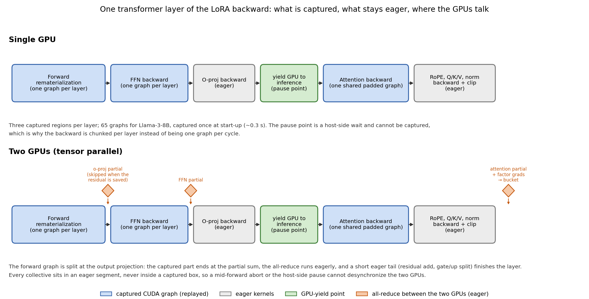
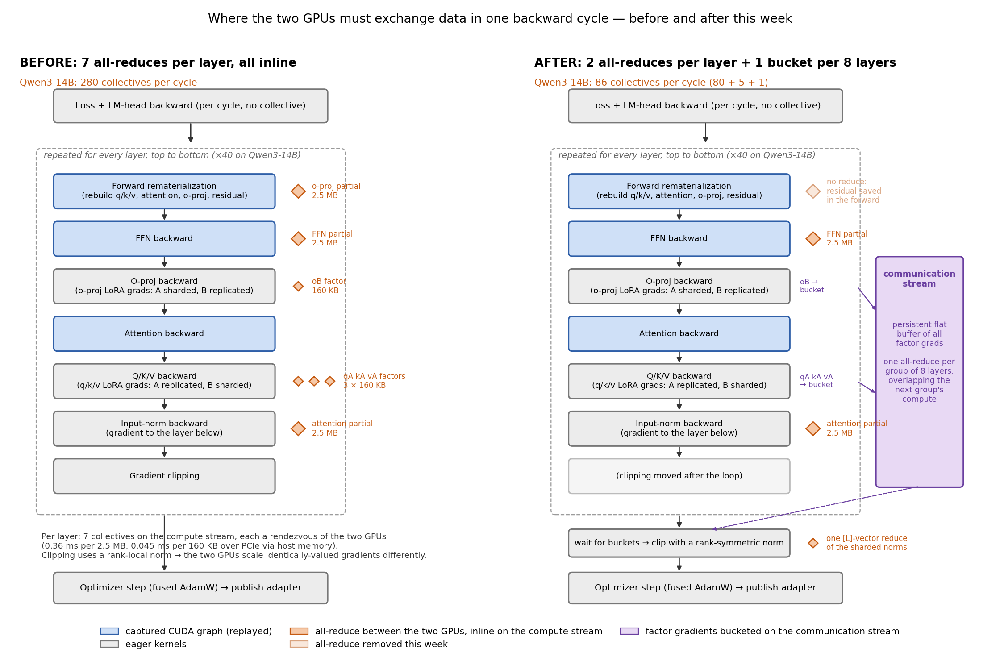
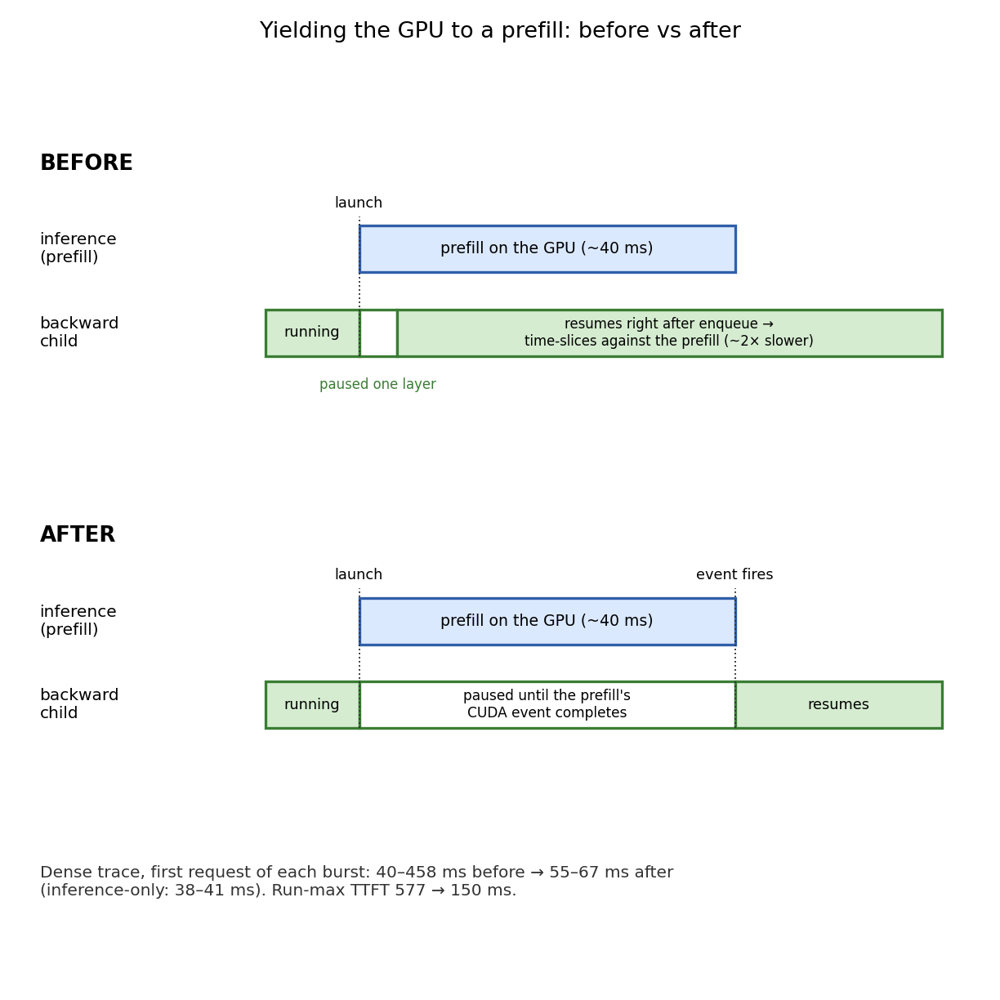

# Weekly report — week of September 1

DeltaServe on vLLM: co-serving LoRA finetuning next to inference on two RTX 5090s
(tensor parallelism across the two GPUs). This week closed the remaining gaps in the
backward pass under tensor parallelism, cut the backward's own cost by about a third,
made inference pre-emption of finetuning work with two GPUs, and validated the whole
stack on both model families (Llama-3-8B and Qwen3-14B) against recorded request traces.

## 1. CUDA graphs for the backward pass, now with tensor parallelism

**Background.** The finetuning backward pass runs in a separate process on each GPU. It
rematerializes each transformer layer's forward from saved activations, then computes the
LoRA gradients by hand. Before this week the backward could run as a set of CUDA graphs on
a single GPU (a graph replays a pre-recorded sequence of kernels with one launch, removing
per-kernel dispatch cost), but with two GPUs it was forced back to eager execution.

**Why two GPUs were harder.** Under tensor parallelism each GPU holds half of every
attention head and half of the feed-forward block, and the two halves have to be added
together at several points in every layer with an all-reduce over NCCL. A collective inside
a captured graph is possible but dangerous here: the backward must yield the GPU to
inference at every layer boundary (a host-side wait that cannot be captured), and a
one-sided abort with a collective in flight would deadlock both GPUs. So the rule became
**no collective is ever inside a graph**.

**What we did.** Six of the seven all-reduces per layer already sat in eager code between
the captured regions. The seventh, the output-projection sum of the forward
rematerialization, sat inside the forward graph. We split that graph at the output
projection: the captured part ends at the partial sum, the all-reduce runs eagerly, and a
short eager tail finishes the layer. On a single GPU the tail is captured together with the
core, so single-GPU behaviour is bit-identical to before. The graphed backward also had
to be taught the six backward-side reductions; they were missing, so enabling graphs under
TP without that would have trained on un-reduced gradients.

**Structure.** Three captured regions per layer: the forward rematerialization, the
feed-forward backward, and one shared padded-attention backward used by every layer.
Llama-3-8B: 65 graphs, captured once at startup in about 0.3 s. The GPU-yield point stays
between the two backward replays of each layer, once per layer, unchanged from the eager
path.

**Verification.** Two new tests run on both GPUs with real NCCL: a layer-level parity test
(graph equals eager on each GPU to 1e-5, equals the single-GPU reference, identical across
GPUs, including the fallback path when a batch overflows the padded attention budget;
4020 checks) and a trainer-level test that runs the real training loop for several steps
and compares losses and adapter weights across graph, eager, and single-GPU (220 checks).

## 2. Where the backward's time goes, and what we removed

### 2.1 Recompute, activation saving, and the LM head

**The pipeline and where the GPUs must talk.** Each backward cycle walks the layers from
the top down. Under tensor parallelism every layer needs a few all-reduces because each
GPU holds only half of the attention heads and half of the feed-forward block. The two
diagrams below show the same cycle before and after this week's changes; the right-hand
diagram is also the reference for the transfer changes in 2.2.

**All-reduce inventory per layer** (sizes for Qwen3-14B at 256 tokens; measured cost on
this box, whose GPUs have no peer-to-peer link so every collective crosses PCIe through
host memory):

| all-reduce | tensor | size | cost | before | after |
|---|---|---|---|---|---|
| output-projection partial sum | forward rematerialization | 2.5 MB | 0.36 ms | every layer | gone: the post-attention residual is saved in the forward |
| feed-forward gradient partial | backward | 2.5 MB | 0.36 ms | every layer, inline | every layer, inline |
| attention-path gradient partial | backward | 2.5 MB | 0.36 ms | every layer, inline | every layer, inline |
| replicated LoRA-factor gradients (q/k/v A, o B) | backward | 4 × 160 KB | 4 × 0.045 ms | every layer, inline | into a flat buffer, one reduce per 8 layers on a second stream |
| clip norms | after the loop | 40 floats | negligible | — | one reduce per cycle |
| **per cycle (40 layers)** | | | | **280 collectives** | **86 collectives** |

**Activation saving instead of recompute.** The backward used to rebuild most of each
layer's forward from the saved layer input. Three more per-layer tensors are now saved
during the inference forward, each behind a config flag:

| saved tensor | captured where | what the backward no longer recomputes | memory (Qwen3-14B, 256 tokens, per GPU) |
|---|---|---|---|
| q/k/v | post-RoPE for Llama-3; pre-norm q/k plus v for Qwen3 | the Q/K/V projection GEMM and RoPE (Qwen3: only its per-head norm and RoPE remain, both elementwise) | ~48 MB |
| attention context | output of the attention kernel | the attention forward: scores, softmax, AV | ~16 MB |
| post-attention residual | input of the post-attention norm | the output-projection GEMM, the residual add, and the forward's only all-reduce | ~100 MB (full width) |

Qwen3 needed its own variant for q/k: its per-head normalisation sits between the
projection and RoPE, so the values seen after attention are not what the norm's backward
needs. Capturing q and k at the input of the norm modules makes the shortcut exact.

**What is still recomputed per layer, with everything on:**

| item | recomputed? | why |
|---|---|---|
| input RMSNorm | yes | the Q/K/V LoRA-A gradients need the normalised input; it is one elementwise pass, cheaper to redo than to store |
| Q/K/V projection, attention forward, output projection | no | saved above |
| feed-forward gate/up pre-activations | no | saved since an earlier phase |
| softmax inside the attention backward | yes | rebuilt from q/k, standard practice (storing it would cost a per-layer [samples, heads, L, L] tensor) |
| LM head logits | yes, once per cycle | the inference forward only materialises last-token logits; the full fp32 logits GEMM is unavoidable |

**A kernel-level profile changed the priorities.** One real backward cycle on a
Qwen3-14B-shaped model, two GPUs, no inference running, graphs and all saves on:

| component | before | after this week | what changed |
|---|---|---|---|
| LM head | 63 ms | ~21 ms | per-sample GEMMs with ~31 rows each, and the bf16 head converted to fp32 nine times per cycle → all rows batched into one GEMM per vocabulary chunk, each chunk converted once per pass; same fp32 math (verified to 1e-7) |
| NCCL all-reduces | 37 ms | ~34 ms | 240 → 86 collectives; the 80 residual reduces remain on the critical path |
| feed-forward and attention backward GEMMs | 22 ms | 22 ms | untouched (bf16, near their microbenchmark) |
| elementwise and reductions | 17 ms | 17 ms | norm backwards in fp32, SiLU, clipping, AdamW |
| staging copies | 10 ms | 10 ms | saved activations into the graphs' static buffers |
| **cycle** | **~165 ms** | **~121 ms** | |

Over the week the uncontended Qwen3-14B cycle went from ~194 ms (eager, no saves) to
~121 ms: roughly 5 ms from graphs, 15 ms from the activation saves, 42 ms from the head,
and a few ms from the transfer changes in 2.2.

### 2.2 GPU-to-GPU transfer: bucketing and a communication stream

**Before** (left-hand side of the diagram above). All 240 reductions per cycle were
issued inline, on the same CUDA stream as the compute, at the point in the layer where
each gradient was produced: the two residual-stream partials that the next operation needs
immediately, and the four replicated LoRA-factor gradients that nobody reads until the
optimizer step at the end of the cycle. Each reduce is a rendezvous between the two GPUs,
so the compute stream stalled 7 times per layer, and the backward process was started
with the CUDA setting that pins every stream onto a single hardware queue (inherited from
the original DeltaServe), so no overlap between communication and compute was possible
even in principle.

There was also a correctness problem hiding in the same place: gradient clipping ran
per layer on each GPU over the tensors that GPU held, replicated factors in full but only
its own half of the sharded ones. The two GPUs derived slightly different clip scales and
applied them to gradients that are supposed to be identical, so their replicated adapter
weights drifted apart whenever a layer's gradient norm exceeded the clip threshold.

**After** (right-hand side). The two residual-stream reduces stay where they are, since
the next operation depends on them. The four factor gradients are instead copied into one
persistent flat buffer as they are produced and reduced once per group of eight layers on
a dedicated communication stream, overlapping the next group's compute; 240 collectives
become 86 (80 residual reduces, 5 buckets, 1 for clipping). Clipping moves after the
bucketed reduce and uses a norm that sums the sharded halves across GPUs in one tiny
collective, so both GPUs scale identically. The single-queue setting is gone.

**Ordering correctness** lives in one helper: every submit waits for the producing
compute, every consumer waits for the completion event, only persistent buffers are
submitted. It is tested by running the same training with a synchronous mode (wait after
every reduce) and a delay-injection mode (the communication stream spins before each
collective, so any missing wait reads stale data every time) and requiring bit-identical
results, plus a CPU test where the clip fires and the two-GPU run must match the
single-GPU run. The measured time saving is small, about 2 ms per cycle, because the 80
residual reduces stay on the critical path; that is the floor for tensor parallelism on
this hardware. The real gain is the correctness fix.

## 3. Inference pre-empting finetuning-only steps

**What it is.** When no inference request is waiting, the scheduler builds steps made only
of finetuning samples. An inference request that arrives during such a step would
otherwise wait for it to finish. Pre-emption lets the request cut in at three points: a
short wait on the input queue before an FT-only step is scheduled, a rollback if a
request landed between scheduling and dispatch, and an abort in the middle of the forward.
The mid-forward abort is an event that the engine's input thread sets on arrival and that
the per-layer activation hooks check; the hook raises, the runner returns an empty result,
and the scheduler restores its bookkeeping so the samples are retried later.

**Single GPU.** Everything runs in one process, so a shared in-memory event is enough.

**Two GPUs: the challenges.** The GPU workers are separate processes from the engine, so
the event never reached them; the feature was silently inert. Worse, even with a signal,
each GPU checking it independently would be wrong: an FT-only forward runs a collective
every layer, so if one GPU leaves at layer k while the other continues, the other blocks
forever in the next collective. The abort has to be a joint decision. Further, the
"aborted" marker on the result was a dynamic attribute that did not survive the
worker-to-engine hop, and the engine's async pipeline calls a second sampling entry point
that also had to know about the abort.

**What we built.** The engine publishes an arrival counter in POSIX shared memory,
created before the workers are spawned. Each worker compares the counter against its
value at forward start, once at entry and once per layer boundary, and MAX-all-reduces
its local bit over the TP group's CPU (gloo) group before acting, so both GPUs always take
the same decision at the same layer; one small CPU collective per layer, no GPU sync. The
first live run exposed a mistake: the hooks are armed for every batch that carries
finetuning samples, including mixed batches with inference tokens, and those were being
aborted too, taking their inference requests' step with them. The decision is now active
only for FT-only forwards. Two secondary findings were also fixed: the CPU launches layers
far ahead of the GPU, so a hook-time abort only saved the un-launched tail (the poller now
bounds the launch-ahead to two layers), and, most importantly, most burst-start requests
were slow for a different reason entirely.

<table>
<tr>
<td width="52%" valign="top">

<b>The pause finding.</b> On the dense trace, the first request of each burst usually
arrived while the backward was running, not during an FT-only forward. Its prefill took
80 to 200 ms instead of 40 ms because the "yield the GPU to prefill" grant was re-set right
after the prefill was enqueued, not when it finished, so the backward resumed immediately
and the two processes time-sliced against each other on the GPU. The runner now records a
CUDA event behind the prefill and resumes the backward only when that event has completed.

</td>
<td width="48%" valign="top">

</td>
</tr>
</table>

**Result on the dense trace (Qwen3-14B, 8 bursts of 60 requests):**

| run | TTFT satisfaction | p99 | max | first request of each burst (ms) | FT tok/s |
|---|---|---|---|---|---|
| inference only | 100 % | 86 ms | 113 ms | 40 41 40 39 38 40 38 41 | — |
| co-serving, before | 99.2 % | 377 ms | 577 ms | 92 52 144 53 44 40 458 58 | 277 |
| co-serving, after | 100 % | 91 ms | 150 ms | 55 60 67 61 61 60 59 64 | 262 |

## 4. Validation

Both families now co-serve the loose, dense, and Nutanix traces with the full stack
(inference-only satisfaction is 100 % on every trace):

| | TTFT satisfaction (loose / dense / Nutanix) | FT tok/s |
|---|---|---|
| Qwen3-14B TP=2 | 98.3 / 100 / 99.4 % (1 Sept: 95.0 / — / 98.1) | 642 / 262 / 392 (was 467 / — / 239) |
| Llama-3-8B TP=2 | 99.2 / 96.9 / 98.5 % (SLO 0.25 s) | 1088 / 641 / 814 |

Also verified: the Llama-3 RoPE base-frequency fix from last week (the backward's
rematerialization now matches the served model to bf16 noise and the loss no longer
stalls), and the Qwen3-0.6B single-GPU path, which needed a fix for models whose LM head
is tied to the embedding.

## 5. Next

The SLO estimator's coefficients are fitted with no backward running; with the pause now
holding through the whole prefill, the contention pattern has changed. The next step is a
two-GPU versus single-GPU residual comparison of the estimator to see whether its
step-time model needs a tensor-parallel term.
