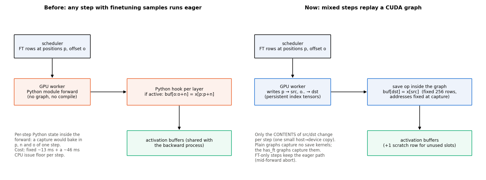
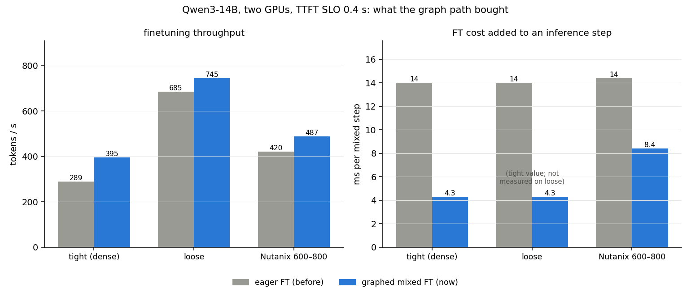
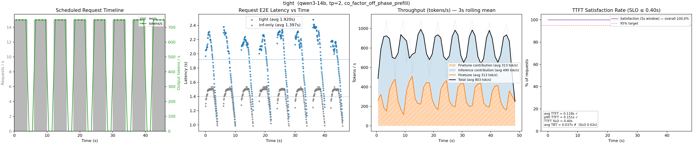
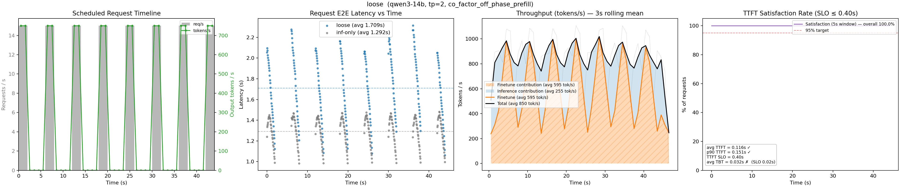
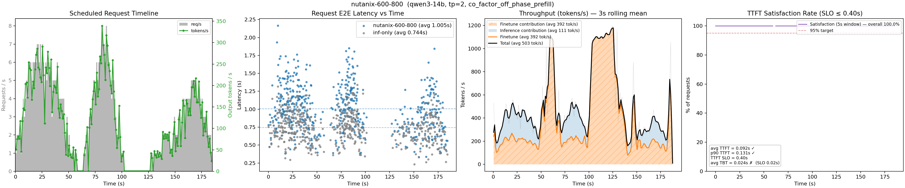
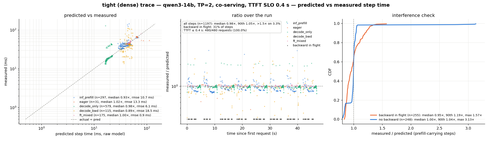
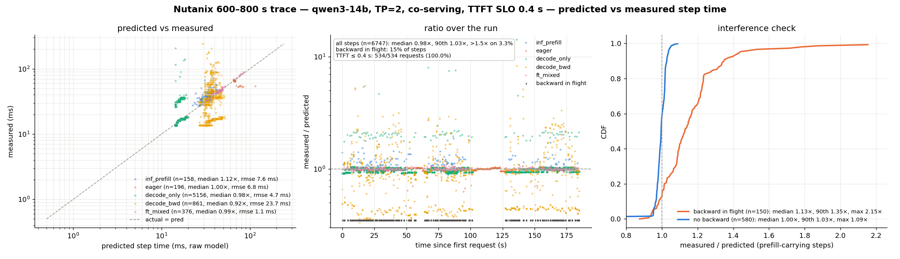
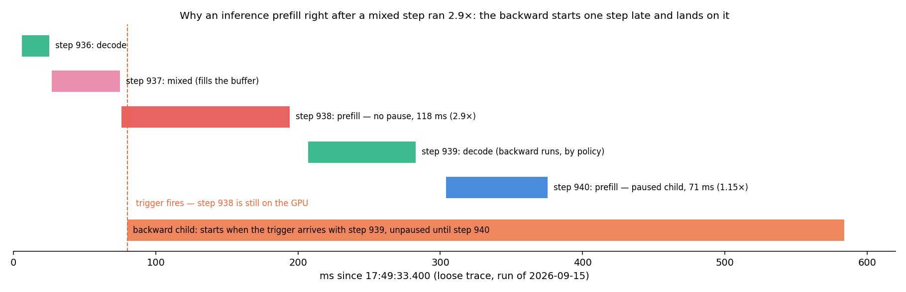

# Weekly report — week of September 14

DeltaServe on vLLM: co-serving LoRA finetuning next to inference on two RTX 5090s
(tensor parallelism across the two GPUs, Qwen3-14B). This week's work lives on the branch
`mixed-fwd-cuda-graph`: it removes the long-standing rule that any forward step carrying
finetuning samples must run without CUDA graphs, measures what that buys on the three
request traces, and follows the consequences into the backward's scheduling. Everything
here is Qwen3-14B unless stated; the time-to-first-token target is 0.4 s and the
time-between-tokens target 50 ms, as last week.

## 1. The rule we removed, and why it existed

Every step of the engine is one batch that mixes prefill and decode work. When the
scheduler admits finetuning samples into a step, the step also has to *save* the
activations those samples produce (the residual stream at every layer, the attention
inputs and output, the MLP pre-activations) into buffers the backward process reads. Since
the first integration those saves have been Python hooks on the layer modules, and hooks
that read per-step state — which rows are finetuning rows, and where in the buffer they go
this step — cannot live inside a CUDA graph: a graph replays exactly what it recorded, so
it would replay one step's positions and offsets forever. On top of that, the original
DeltaServe had been burned by saving activations into memory a later graph replay reused.
So the rule was: any step with finetuning tokens bypasses vLLM's compiled forward and every
graph and runs the plain Python module path.

That is expensive in a way that had become the binding constraint. From the launch
profiling pass, same shapes, no backward running:

| tokens in the step | graphed inference prefill | eager with finetuning | CPU issue time (eager) |
|---|---|---|---|
| 192 | ~41 ms | 53 ms | 46 ms |
| 256 | 52 ms | 65 ms | 62 ms |
| 576 | ~108 ms | 125 ms | 91 ms |

The eager penalty is a fixed 12 to 16 ms per step of launch and Python overhead, sitting on
a ~46 ms CPU issue floor. The mixed step that matters on this hardware — a 50-token
prefill, a few decodes, one sample — cost 49 ms eager against a 50 ms time-between-tokens
gate, so admission fitted only the smallest samples and 438 of 493 prefill steps on the
dense trace carried no finetuning at all. Most finetuning ran in idle gaps.

## 2. What we built

The saves became **a fixed-shape operation whose per-step inputs are data, not code**, the
same pattern vLLM uses to hand attention its per-step metadata:

- **A custom save op replaces the hooks.** It always gathers 256 rows of the layer's tensor
  through a persistent *source-index* tensor and writes them into the activation buffer
  through a persistent *destination-index* tensor. The finetuning rows' positions and the
  buffer offset are the *contents* of those two tensors, refreshed by one small
  host-to-device copy before the step; the addresses and shapes never change, so a graph
  can bake them in. Unused slots write a scratch row. Interleaved or contiguous layouts no
  longer matter.
- **The model calls it at the seven save points** (the residual entering each layer and the
  post-attention norm, the MLP pre-activation, q/k/v, the attention output, the final norm
  input). The calls trace to nothing unless finetuning installed a slot on the module, so
  non-finetuning deployments compile the same graph as before.
- **A second set of piecewise graphs** is captured at startup for batches that carry
  finetuning samples next to inference tokens, and the runner dispatches mixed batches into
  it. Finetuning-only batches deliberately stay eager: they are the only ones the
  mid-forward abort (last week's pre-emption work) applies to, and that abort is a Python
  exception raised between layers.
- **The predictor got a fourth mode.** A step with finetuning samples used to be one cost
  model. Now a *mixed* step replays a graph and an *FT-only* step runs eager, ~10 ms
  apart for the same composition, so they are fitted separately and admission predicts
  with whichever the candidate step would be. Off, everything collapses back to the old
  single mode.
- One thing we found only by doing it: an output-less custom op is dead-code-eliminated
  by the compiler in this torch build. The op therefore declares a mutation on a 1-element
  marker buffer on the calling module, exactly as vLLM's attention op does, while the real
  destination comes from the forward context. And the finetuning flags are now part of
  the torch.compile cache key, because toggling the feature with the same source loaded
  the other configuration's compiled graph.

Correctness by construction: the destination is the persistent buffer shared with the
backward process, outside any graph pool, and the copy executes inside the replay, so the
original aliasing hazard cannot occur. The dedicated test captures a graph once and
replays it with different index contents, checking that the saved rows follow the
contents; the accumulator's op path matches the hook path bit-for-bit on a fake model; and
a Qwen3-0.6B single-GPU run trains identically either way, cycle for cycle
(4.402 / 4.403 → 2.327 / 2.325 → 1.735 / 1.730), with the rematerialization check at
bf16 noise.

## 3. What it bought, and what it cost

| | dense (tight) | | loose | | Nutanix 600–800 s | |
|---|---|---|---|---|---|---|
| | before | now | before | now | before | now |
| TTFT satisfaction | 100 % | 100 % | 100 % | 100 % | 100 % | 100 % |
| TTFT p50 / p95 / p99 (ms) | 76 / 94 / 121 | 113 / 175 / 221 | 75 / 95 / 132 | 112 / 172 / 220 | 74 / 115 / 178 | 79 / 177 / 255 |
| finetuning tok/s | 289 | **395 (+37 %)** | 685 | 745 (+9 %) | 420 | **487 (+16 %)** |
| prefill steps carrying finetuning | 17 / 480 | **175 / 474** | — | 77 | 228 / 534 | 376 / 533 |
| finetuning tokens per mixed step (p50) | 23 | 46 | — | — | 29 | **60** |
| finetuning cost above the same inference step | 14.0 ms | **4.3 ms** | — | — | 14.4 ms | **8.4 ms** |
| worker CPU time per mixed step | 45 ms | **2 ms** | 62 ms | 2 ms | 45 ms | 2 ms |
| requests with a token gap > 50 ms | 57 / 480 | **420 / 480** | 60 / 240 | 235 / 240 | 188 / 534 | 382 / 534 |
| median time-between-tokens | 29 ms | 40 ms | 26 ms | 31 ms | 20 ms | 25 ms |

The mechanism delivered what the design predicted. The marginal cost of putting samples
into an inference step fell from ~14 ms to 4 to 8 ms (what remains is the samples' own
compute plus the fixed-size save), and the worker CPU went from saturated to idle. Because
the admission gate sits at the 50 ms time-between-tokens limit, that headroom is spent at
once: ten times as many prefill steps carry finetuning on the dense trace, and on Nutanix
every mixed step carries twice the tokens. Finetuning throughput +37 / +9 / +16 %,
time-to-first-token still 100 % on every trace (medians move up toward the target, as
designed).

The cost is the one the design note predicted, only sharper. Every decoding request now
rides ~47 ms mixed steps far more often, so the median time-between-tokens rises ~10 ms
on the dense trace and the share of requests with at least one gap over 50 ms goes from
12 % to 88 %. The gate admits up to a *predicted* 50 ms and the safety margin is still
effectively zero (last week's finding), so steps predicted at 47 to 50 ms routinely measure
50 to 55 ms. A dense-trace run with the target lowered to 45 ms shows the dial works:
finetuning +12 %, 159 instead of 420 violating requests, TTFT 100 %. Memory: the second
capture set raised graph memory from 5.0 to 6.8 GiB and halved the KV cache (59.7k →
32.1k tokens), still enough for 15 concurrent 2048-token requests. Startup: +63 s to
compile once (cached afterwards), +13 s to capture.

The per-step predictor stays accurate through the change (mixed graphed steps predicted to
1.1 to 1.5 ms RMSE, median ratio 0.99 to 1.00):

## 4. A race in the backward's start, and a fix that was right and wrong at once

The trace showed inference prefills running 2.6 to 2.9× their prediction immediately after
a mixed step, with no backward flagged. Reconstructing one of them:

**The problem.** The mixed step fills the activation buffer, and the scheduler orders the
backward to start. Under tensor parallelism that order can only travel to the GPU workers
with the *next* step they receive. The workers run two steps back-to-back in a pipeline, so
when the order arrives, the step after the mixed one is already on the GPU, and it had
decided "nothing to pause" when it started, because no backward existed then. The child
starts at full speed on top of it. Only the following prefill pauses the child, ~100 ms
later. Last week this appeared as "the first prefill after a backward runs 1.2×"; it got
more visible now only because the buffer fills mid-burst instead of in idle gaps. It is
not two steps: ~15 % of the steps following a mixed step ran > 1.4× (dense 26, loose 15,
Nutanix 89; the Nutanix baseline already had 44).

**The fix, and what it showed.** The pause check is "prefill present *and* a backward is
running"; the second half is a leftover from when resuming required a blocking
synchronize. Dropping it (pause on every prefill; the existing completion-event poller
re-grants) removes the slow prefill successors entirely (loose: 2 → 0; dense: 0 of 7).
But it also collapsed finetuning throughput 2 to 3× (dense 400 → 168 tok/s, loose 739 →
132, Nutanix 488 → 155) and stretched backward cycles from ~150 ms to 540 to 630 ms
median, with maxima of 10 to 25 s. The reason is the honest part: once finetuning rides
most prefills of a burst, the pause policy leaves the child only the decode-only windows,
about 30 % of the time, and the race had been quietly giving it its first ~100 ms of
every cycle. Fixing the race exposes that the backward has no deliberate GPU share during
bursts. The fix ships behind a flag (`pause_prefill_always`), off by default, with the
numbers in the config docstring.

## 5. Bugs found on the way

- **Padded output vs unpadded mask.** The post-forward save of the final hidden states
  indexed the graph's padded output (192 rows for a 186-token batch) with a mask built for
  the unpadded batch. Only the interleaved-rows layout takes that path, so the dense and
  loose traces never hit it; the first Nutanix rerun lost 428 of 534 requests to a worker
  crash. Fixed and covered by the test; the rerun is clean.
- **Compile cache keyed without the feature.** The first hook-path A/B on the 0.6B model
  loaded the graph-path run's compiled artifact and failed on a missing buffer. The
  finetuning flags are now part of the cache key.

## 6. Validation summary

`tests/test_ft_save_op.py` 30/30 (graph replay follows index contents; op path equals hook
path; the padded-output case), the CPU gates re-pass (`test_accumulate_hooks` 153/153,
`test_merged_estimator` 57/57 with the new mode, relay 26/26, step trace 28/28), the
Qwen3-0.6B hook-vs-graph parity run, and the three Qwen3-14B replays above, rerun once more
after the padding fix with identical results within noise. The `tp` branch is untouched.

## 7. Next

The gain is real and stable; the question it opens is policy, not mechanism. Three
candidates for giving the backward a deliberate share during bursts, in order of
preference: a bounded per-cycle unpaused budget for the child (the race made explicit),
pausing only when the in-flight prefill's time-to-first-token slack is actually short
(the scheduler already computes it at admission), or MPS with a small share for the child,
which bounds the contention instead of time-slicing it. Independently, a real safety
margin on the predictor (relative or absolute instead of the current `1 + 1.5·RMSE` in
seconds) would let the 50 ms time-between-tokens target mean 50 ms measured.
